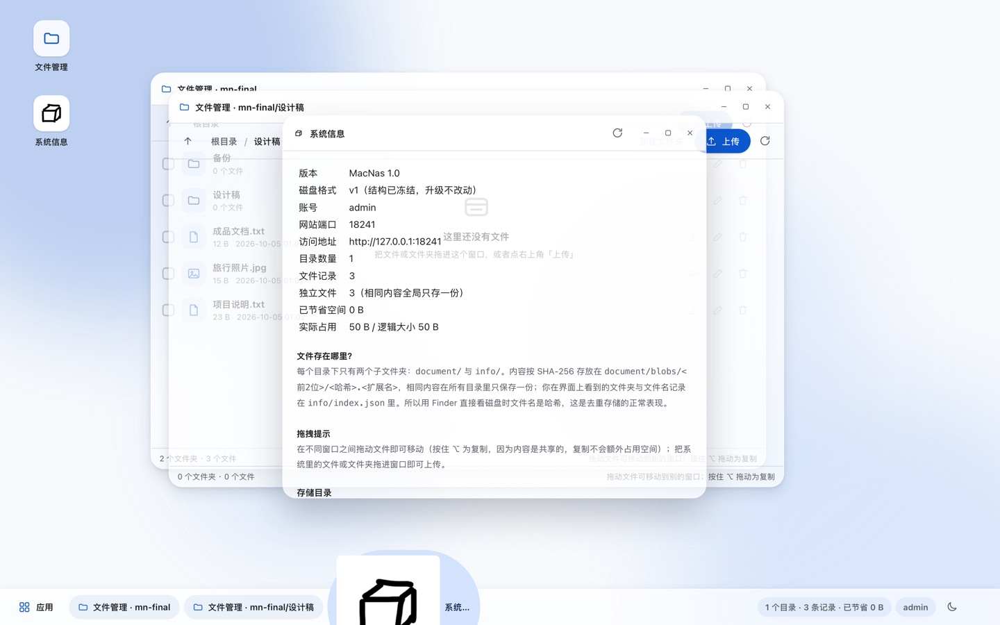
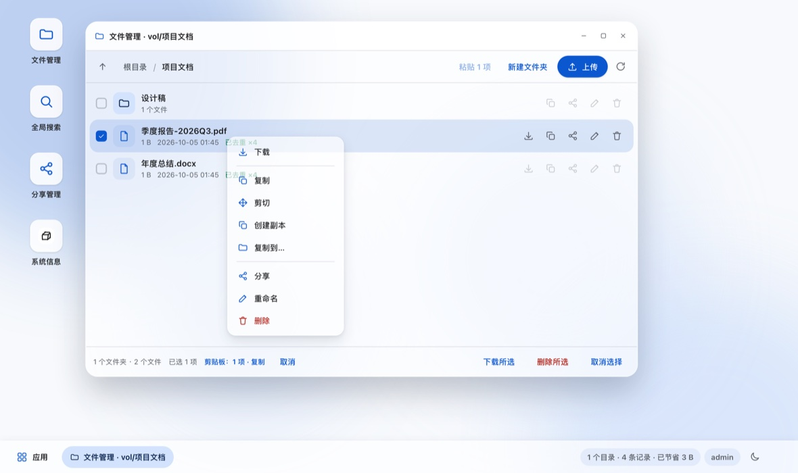
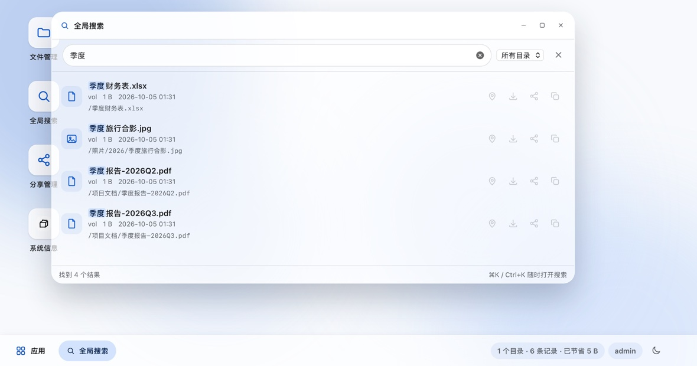
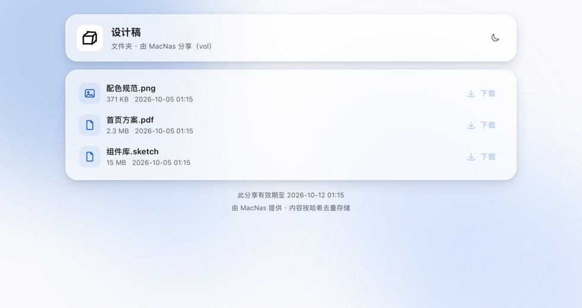
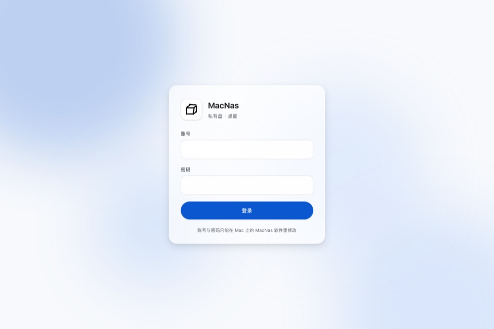

# MacNas

把 Mac 变成一台私有 NAS：文件按**内容哈希全局去重**存储，通过网页在局域网内随时上传下载。

- macOS 原生 App（SwiftUI）+ 内置 HTTP 服务器（Network.framework，**零第三方依赖**）
- 网页端：Material 风格、蓝色主色、毛玻璃、无渐变，内置「文件管理」应用
- 账号密码与端口**只能在 Mac 软件里修改**，网页端只有登录入口

---

## 一、核心存储设计：哈希去重 + info 索引

每个“NAS 目录”（下称**卷**）下固定只有两个子文件夹：

```
<你选择的目录>/
├── document/                         ← 真正的内容
│   └── blobs/
│       ├── 2b/
│       │   └── 2be03589…7756.txt     ← 文件名就是它的 SHA-256（前 2 位做分片）
│       └── 75/
│           └── 752b91fb…9ff1.txt
└── info/                             ← 记录（软件重启后据此完整还原）
    ├── index.json                    ← 该卷全部文件记录
    ├── index.json.bak                ← 上一次的完好索引（自动维护，损坏时回退）
    └── volume.json                   ← 卷身份（id / 名称 / 格式版本），保证卷被搬动后 id 不变
```

### 上传时发生的事情

1. 浏览器把文件流式发到服务器，**边收边写临时文件、边算 SHA-256**（不占内存、不读第二遍）。
2. 用哈希在**所有已添加的卷**里查重：
   - **没有相同哈希** → 把文件移动到目标卷的 `document/blobs/<前2位>/<哈希>.<扩展名>`，然后在 `info/index.json` 里写一条记录：哈希 + 存储位置 + 存放目录。
   - **已有相同哈希** → **完全不落盘**，只在目标卷的 `info/index.json` 里追加一条记录，指向已存在的那份内容（可能在别的卷里）。

这就是“同一个文件只占一份空间”的实现方式；网页上这类文件会标出 `已去重 ×N`。

### 一条记录长什么样

```json
{
  "id": "E8553494-…",
  "name": "b.txt",
  "sha256": "2be03589abeb9438e64422ea6ffd18d2ba8d47b8bd70d14aeb7aeefc21ee7756",
  "size": 19,
  "logicalPath": "/文档/b.txt",
  "storageVolumeId": "414DF898-…",
  "storageRelPath": "blobs/2b/2be03589…7756.txt",
  "createdAt": "2026-10-04T16:20:51Z",
  "source": "web"
}
```

- `logicalPath` = **存放目录**（用户在网页上看到的位置）
- `storageVolumeId` + `storageRelPath` = **存储目录**（内容实际躺在哪）
- 两者可以指向不同的卷 —— 跨目录去重就是这么实现的

### 删除的语义（引用计数）

删除一条记录**不会**立刻删掉物理内容：只有当一个哈希的**最后一条记录**被删除时，`document/blobs` 里的文件才会真正被移除。所以删掉某个副本，其它引用它的目录完全不受影响。

其它健壮性设计：

- 启动时逐个校验 `document/blobs` 里的内容是否存在；内容被手工挪动过会自动按哈希找回并修正记录，彻底找不到的会在目录详情里提示“有 N 条记录的内容缺失”。
- 「清理孤立文件」可以删掉 `document/blobs` 里没有任何记录引用的残留文件。
- 所有文件名会做校验：拒绝 `..`、空名、含 `/` 或 `:`、控制字符；路径归一化后一定落在卷内（`/../../etc` → `/etc`）。
- `info/index.json` 采用原子写入（临时文件 + rename），中途断电不会写坏。

### 升级不改变结构：格式版本与兼容保证

磁盘格式被当作**对外契约**固定下来（完整条款见 `docs/FORMAT.md`），任何后续版本都必须遵守：

1. **目录结构冻结** —— 卷里永远只有 `document` 与 `info` 两个子文件夹；新功能只能往这两个文件夹**内部新增**，不得改名、移动、删除。老版本遇到不认识的子文件/子文件夹一律忽略。
2. **字段只增不改** —— `index.json` / `volume.json` / `config.json` 里已有字段的名称与含义永不改变；新增字段必须可缺省。所有解码都是**宽容解码**：缺字段、类型不符、甚至某条记录畸形，都不会让整份索引读不出来。
3. **未知字段原样保留** —— 老版本读到新版本写入的字段时，会在写回时原样带回去。“新版本写 → 老版本改一次 → 再回到新版本”不丢任何信息。
4. **新版本数据只读打开** —— `formatVersion` 高于当前软件能读的版本时，该卷只读：可浏览、可下载，写操作返回 `409` 并提示升级，**卷内一个字节都不会被改写**（`volume.json` 也一样）。
5. **内容可重建** —— 物理文件名就是内容哈希，所以 `info/` 全部丢失也能按哈希重建记录并正常下载。

数据恢复能力（都有自动化测试覆盖）：

| 场景 | 行为 |
| --- | --- |
| 写入过程中断电 | 索引原子写入，不会写出半截文件 |
| `index.json` 被外部改坏 | 自动回退 `index.json.bak` 并写回修复 |
| 索引与备份都没了 | 按哈希从 `document/blobs` 重建（命名 `recovered-<哈希前8位>.<扩展名>`） |
| 内容被挪到别的卷 | 按哈希全盘找回并修正记录里的实际位置 |
| 只有显示名称变了 | 内容不变时连 `volume.json` 都不会被重写（不改 mtime） |

---

## 二、软件端功能

### 首次启动（初始化向导，三步）

1. **选择第一个目录** —— 选择文件夹后自动创建 `document` 与 `info` 并等待就绪；也可以直接「打开已有目录」，系统会读取已有的 `info/index.json` 把记录全部读回。
2. **设置账号密码** —— 网页登录用；只能在软件里修改。
3. **选择端口** —— 实时显示端口是否可用，并预览局域网访问地址。

点「完成并开启网站」后立即开放在你选择的端口上。

### 主界面

- **概览**：服务状态（运行中/已停止/失败原因）、启动/停止、局域网地址（一键复制）、统计（文件记录数 / 独立文件数 / 已节省空间 / 实际占用）、所有目录位置、「在 Finder 中显示」、最近日志。
- **存储目录**（侧栏每个卷一项）：`document` / `info` / `index.json` / `index.json.bak` 的完整路径与打开按钮、磁盘格式版本、使用情况、重命名卷名、清理孤立文件、**按哈希重建索引**、从软件中移除（**只移除记录，磁盘文件不动**）。由更新版本写入的目录会显示「只读 · 需要更新版本」，相关写操作按钮自动禁用。
- **日志**：级别过滤、关键词搜索、自动滚动、打开日志文件。
- **写入性能（格式 v2 追加日志）**：日常改动只往 `info/index.log` 追加一小段，不再每次重写整份索引。实测 5,000 个文件时：单次写入 **74.5ms → 5.6ms**、写 5,000 条 **173 秒 → 14 秒**。已有目录不会被自动升级（老版本仍可读写），要更快就在「设置 → 写入性能」里点一下「启用快速写入」。
- **WebDAV 可直接挂到 Finder**：用真实 macOS 客户端的 User-Agent 与请求顺序（匿名 `OPTIONS *` → 带凭据 `OPTIONS` → `PROPFIND Depth:0/1` → `MKCOL`/`PUT`/`MOVE`/`DELETE`）逐条重放验证，挂载后读写删改都与软件内一致。
- **照片收集（免登录上传）**：在任意文件夹上「收集照片…」生成一条链接，发给朋友（婚礼、班级、聚会），他们**不用注册、不用登录**，打开就能选照片或直接拖进来。可以限制**单个文件大小**与**这条链接总共能收多少**，还能设有效期与访问密码。收集链接**只进不出**：访客看不到也下载不了已经收到的照片，链接泄露也不会泄露内容。同名照片自动改名，不会因为重名让访客上传失败（实测：同一张照片传两次 → `合照.png` 与 `合照 (2).png`）。
- **镜像导出（给 SMB / Time Machine）**：把逻辑目录铺成一份真实文件夹，同一磁盘上用**硬链接**，几乎不占额外空间；重复导出只补变化的部分。导出目录可以直接在 macOS「文件共享」里共享，Time Machine 也能备份它。
- **秒传**：浏览器端先算 SHA-256（Web Crypto 优先，http 局域网下自动退回内置纯 JS 实现并经标准向量校验），命中库里已有内容就**零字节**建记录 —— 同一张专辑、同一份文档再传一次是瞬间的。
- **照片墙与缩略图**：文件夹支持「列表 / 网格（缩略图）」切换，缩略图按内容哈希缓存、进入可视区域才加载且最多 4 个并发；「照片」应用按月份分组展示图片与视频，点开即预览。
- **手机端与 PWA**：窄屏自动切换成手机布局（窗口全屏、底部应用栏、触摸目标放大、行尾「⋯」菜单），可「添加到主屏」像应用一样打开，断网时至少能打开外壳；手机上有「拍照」按钮直接从相机上传。
- **回收站**：删除默认只是移入回收站（内容引用计数不变），可随时还原、按需彻底删除；超过保留期（默认 30 天，可在设置里改）自动清理。桌面图标带数量角标。
- **文件历史版本**：覆盖上传会把旧内容留成历史版本（最多 20 版），可以下载或一键回滚。因为内容按哈希存储，历史版本几乎不占额外空间。
- **文件预览**：照片、视频、音频、PDF、文本/代码、Word/RTF/ODT、Excel/PPT 都能直接在网页里看（桌面窗口与分享页同一套）。图片可以切换「适应窗口 / 原始尺寸」，视频音频支持拖动进度。只用 macOS 自带的 `textutil` 与 `qlmanage`，不引入任何第三方库；转换结果按内容哈希缓存，第二次打开是瞬时的。
- **窗口布局记忆**：网页端会记住你开着哪些窗口、各自的位置与大小、层叠顺序，以及每个文件管理器停在哪个目录；下次打开网页（或重新登录）自动还原，不用每次重新摆一遍。任务栏右侧的图标可以随时关掉这个记忆（关掉时会清掉已存布局）。关网页或切到后台时会立刻落盘，最后的拖动也不会丢。
- **设置**：修改账号密码（会注销所有网页登录）、修改端口（保存后自动用新端口重新开放）、**WebDAV 开关与只读模式**、开机自动开放网站、打开配置/日志目录、清除本机配置并重新初始化。

### 目录位置与日志文件

- 配置：`~/Library/Application Support/MacNas/config.json`
- 分享链接：`~/Library/Application Support/MacNas/shares.json`
- 日志：`~/Library/Application Support/MacNas/logs/macnas.log`（超过 4MB 自动轮转）
- 上传临时文件：`~/Library/Application Support/MacNas/uploads/`（启动时自动清理残留）

---

## 三、网页端：桌面式界面

浏览器打开 `http://<Mac的IP>:<端口>`（例如 `http://192.168.1.20:8080`），
会看到一个类桌面环境：壁纸 + 桌面图标 + 任务栏 + 可任意开关的窗口。



### 窗口

- **可以同时打开多个「文件管理」窗口**，每个窗口独立浏览不同目录。
- 窗口支持拖动（拖标题栏）、缩放（拖右下角）、最小化、最大化、关闭；
  点任务栏上的按钮可在窗口之间切换，重复点击可最小化。
- 左下角「应用」是应用列表，桌面上双击图标也能打开应用。
- 目前有两个应用：**文件管理**、**系统信息**（版本、端口、统计，以及“文件到底存在磁盘哪里”的说明）。

### 拖拽：窗口之间搬文件

- **按住文件/文件夹拖到另一个文件管理窗口** → 移动（记录换位置）。
- **按住 ⌥（Alt）再拖** → 复制。
- 拖到某个**文件夹行**上 → 放进那个文件夹。
- 把**系统里的文件或文件夹直接拖进窗口** → 上传（文件夹会按相对路径建目录）。
- 移动/复制**不会搬运数据**：内容按哈希全局共享，跨目录“移动”也是瞬间完成的；
  复制出来的记录会显示 `已去重 ×N`，不占额外空间。
- 遇到重名自动改成 `名称 (2)`，不会覆盖。

### 复制 / 剪切 / 粘贴



复制不只有拖拽（拖拽要按住 ⌥，手机上还没法拖），完整的复制操作都在这里：

- **右键任意文件/文件夹** → 菜单：下载 / **复制** / **剪切** / **创建副本** / **复制到…** / 分享 / 重命名 / 删除（在空白处右键则是上传 / 新建文件夹 / **粘贴** / 刷新）。
- **复制 ⌘C → 切到目标文件夹 → 粘贴 ⌘V**：内部剪贴板会记录“复制”还是“剪切”，剪切粘贴就是移动。
  状态栏会一直显示「剪贴板：N 项 · 复制/剪切」，旁边有「取消」。
- **工具栏「粘贴 N 项」按钮**：剪贴板有内容且当前目录可写时才亮起，手机/平板上也能操作。
- **创建副本**：在原地复制一份，重名自动变成 `名称 (2)`，不用先复制再改名。
- **复制到…**：弹出目标选择器（可切换目录、进子文件夹、上一级），一步复制到任意位置 —— 适合两个目录离得很远、或者手机上没有两个窗口的情况。
- 复制的是**记录**不是数据：内容按哈希全局共享，所以复制不占额外空间（列表里会标 `已去重 ×N`），跨目录复制也是瞬间完成。

### 全局搜索



- 桌面上的 **「全局搜索」** 应用，或者任何时候按 **⌘K / Ctrl+K** 直接唤起。
- **一次搜所有目录**（也可以限定某个目录），同时匹配**文件名**与**所在路径**：
  例如搜 `季度` 能找到所有名字里带“季度”的文件，把文件放进「季度资料」文件夹里也能被搜到。
- 支持空格分隔的多个关键词（必须全部命中，不分先后）、**大小写不敏感**；
  结果按相关度排序（完全相同 > 前缀 > 包含 > 路径命中），命中的关键词会高亮。
- 每一条结果都能：**打开所在位置**（跳到文件管理窗口并高亮定位到该文件）、下载、**直接分享**、复制路径。
- 搜索是纯内存索引（记录本来就在内存里），几万条记录也是毫秒级；结果上限 500 条并提示“只显示前 N 个”。

### 分享链接（像网盘一样把文件/文件夹给别人）

- 在文件管理窗口里，鼠标移到任意一行 → 点 **分享** 按钮（文件、文件夹都可以）。
- 可选**有效期**（1 天 / 7 天 / 30 天 / 永久）和**访问密码**（留空则凭链接直接打开）。
- 生成后得到形如 `http://192.168.1.20:8080/s/1d6d1d469dbe61f6` 的链接，一键复制发出去。
- 对方**不需要登录 MacNas**：用浏览器打开就是干净的分享页，文件夹可以逐层浏览、逐个下载，文件可以直接下载。
- 桌面上的 **「分享管理」** 应用里能看到所有链接：访问次数、下载次数、有效期、状态（有效 / 已过期 / 已取消 / 目标已删除），可以复制、打开、随时取消。
- 链接是 128 位随机 token，猜不到；分享范围被严格限制在那一个文件/文件夹内（尝试访问范围外的路径返回 403）；删除目标文件或取消分享后链接立刻失效。



### 文件管理

- 面包屑导航、上一级、刷新；上传时逐个文件显示进度，命中已有内容会提示“未占用新空间”。
- 下载：点文件名即可；图片点一下直接预览；下载支持 `Range` 断点续传。
- 新建文件夹、重命名、删除、多选批量下载/删除（按 Esc 取消选择，Delete 删除所选，⌘U 上传，⌘K 搜索，⌘C/⌘X/⌘V 复制/剪切/粘贴）。
- 只读目录（由更新版本写入）会显示提示条并禁用所有写操作。

### 外观

- Material 3 风格、Google 蓝 `#0B57D0` 为主色、纯色背景 + 毛玻璃面板，**没有任何渐变**。
- 支持深浅色主题（按钮切换，浏览器记忆），窄屏（手机）自动变成全宽窗口。
- 网站 logo 取自项目根目录的 `AppIcon.appiconset`（已复制为 `MacNas/Web/logo.png`），
  同时用作浏览器标签页图标、登录页品牌图与「系统信息」应用图标。



## 三点五、WebDAV：把库挂载成网络磁盘

WebDAV 直接实现在同一个 HTTP 服务器里，挂在 `/dav`，**映射的是逻辑目录树**（不是磁盘上的哈希文件）。

### 挂载方法

Finder 里按 **⌘K**，输入：

```
http://<Mac的IP>:端口/dav
```

然后用 MacNas 的账号密码登录即可。挂载后可读写、可拖拽、可用任何本地应用直接打开里面的文件。

- 挂载点里能看到所有目录（每个卷是一个文件夹），目录结构与网页端完全一致；
- 右侧那套「哈希去重」对 WebDAV 客户端是透明的：从 Finder 拷进去的文件会**自动算哈希、命中已有内容就不重复占空间**，并且立刻出现在网页端；
- 支持 `PROPFIND / GET / HEAD / PUT / MKCOL / DELETE / MOVE / COPY / LOCK / UNLOCK / PROPPATCH`、`Range` 断点续传、ETag；
- 软件「设置」里可以 **关闭 WebDAV** 或切成 **只读模式**（只读时浏览下载正常，上传/改名/删除一律 403）。

### 几个实际细节

- **认证**：HTTP Basic（账号密码同网页端）。Basic 是明文传输，所以只建议在可信局域网里开启；要暴露到公网请加一层 HTTPS 反向代理。
- **性能（很重要）**：Basic 每个请求都带密码。macOS 的 WebDAV 客户端对**单个请求有约 300~500 毫秒的容忍上限**，超过就直接放弃挂载（实测：每个请求 300ms 能挂上，550ms 挂不上）。所以这里做了三件事：
  1. PBKDF2 改用系统 CommonCrypto（输出与原来逐位一致，老配置不用迁移），单次从 **182ms 降到 15ms**；
  2. 验证结果在内存里缓存 5 分钟，网页端登录后也会顺手预热；
  3. 每条连接一个独立队列（WebDAV 客户端挂载时会同时开十几条连接，共用一条队列会被前面的请求堵住）。
- **自检**：软件「设置 → WebDAV」里有「自检」按钮，会用它自己的地址请求一次 `/dav`，正常应显示「服务器就绪：返回 401 挑战，DAV: 1, 2, 3」。先看自检结果，就能判断问题在服务器还是客户端。
- **锁**：为了让 Office / Finder 保存时不拒绝写入，`LOCK` 会返回合法的锁令牌，但不做真正的互斥 —— 对单用户私人 NAS 足够。
- **挂载失败时先清 macOS 侧缓存**：macOS 会把「这台服务器 + 这个密码」记进钥匙串，并在失败后反复用旧密码重试（表现就是「密码明明对却提示错误」或「连接服务器出现问题」）。打开「钥匙串访问」搜索服务器地址或 IP，删掉对应条目，再重新 ⌘K 挂载。
- **日志能定位问题**：每个 WebDAV 请求都会记录方法、路径、客户端 User-Agent；认证失败会记录客户端发来的用户名（不记录密码）。
- **Windows 资源管理器**的 WebDAV 客户端可用但挑协议，且不支持 chunked 上传；macOS Finder 是主要目标。

## 三点六、原理介绍站点（`web/`）

仓库根目录的 `web/` 是一个纯静态的介绍站点，用和软件同一套视觉（蓝色主色、毛玻璃、无渐变），
把存储原理、格式契约、服务器设计、WebDAV、预览、分享、安全与测试一条条讲清楚：

```bash
open web/index.html          # 直接双击也能看，没有任何外部依赖
```

内容包含：为什么不能把磁盘结构当成目录树、内容寻址与引用计数、上传/复制/移动/删除的真实代价、
冻结的磁盘契约五条规则、HTTP 服务器与接口一览、WebDAV 的握手顺序与那个「OPTIONS 必须免认证」的坑、
网页桌面与布局记忆、预览的格式对照表、分享链接的边界、安全性说明、测试体系、以及完整目录结构。

## 四、HTTP 接口

除 `/api/login`、`/api/session`、`/api/logout` 与静态资源外，全部需要登录 Cookie。

| 方法 | 路径 | 说明 |
| --- | --- | --- |
| POST | `/api/login` | `{username, password}`，成功返回并下发会话 Cookie |
| GET | `/api/session` | 当前登录状态 |
| POST | `/api/logout` | 退出登录 |
| GET | `/api/status` | 端口、账号、文件数、去重节省等 |
| GET | `/api/volumes` | 目录列表（含剩余空间） |
| GET | `/api/list?volume=&path=` | 列目录（含面包屑与去重标记） |
| GET | `/api/search?q=&volume=&limit=` | 全局搜索（匹配文件名与路径，支持空格分隔多关键词） |
| WebDAV | `/dav` | **挂载用**：Basic 认证 + 逻辑目录树（见上一节） |
| POST | `/api/upload?volume=&path=&name=&overwrite=` | **原始二进制请求体**，边收边算哈希 |
| GET | `/api/download?volume=&id=[&inline=1]` | 下载 / 预览，支持 `Range` |
| POST | `/api/mkdir` | `{volume, path, name}` |
| POST | `/api/rename` | `{volume, id, name}` |
| POST | `/api/rename-folder` | `{volume, path, name}` |
| POST | `/api/delete` | `{volume, id}` 或 `{volume, path}` |
| POST | `/api/delete-batch` | `{volume, ids:[…]}` |
| POST | `/api/share/create` | `{volume, id\|path, expiresInHours, password}`，生成分享链接 |
| GET | `/api/shares` | 我创建的全部分享（含状态、访问/下载次数） |
| POST | `/api/share/revoke` | `{token}`，取消分享 |
| GET | `/s/<token>` | **分享页（无需登录）** |
| GET | `/api/pub/<token>[?path=]` | **匿名读取分享内容**（有密码则返回 `needsPassword`） |
| POST | `/api/pub/<token>/auth` | **匿名密码验证**，成功后下发 Cookie |
| GET | `/api/pub/<token>/download?id=` | **匿名下载**（只能在分享范围内） |
| POST | `/api/transfer` | `{fromVolume, ids:[…], paths:[…], toVolume, toPath, mode}`，mode 为 `move`/`copy`（拖拽用，只改记录不搬数据） |

> 上传刻意使用「原始请求体 + 查询参数」而不是 multipart：既能流式落盘、不用把大文件读进内存，也让网页端可以逐个文件显示进度。

---

## 五、构建与运行

### Xcode

打开 `MacNas.xcodeproj`，选 MacNas scheme，Run 即可（macOS 27+ / Xcode 27）。

### 命令行构建

```bash
xcodebuild -project MacNas.xcodeproj -scheme MacNas -configuration Release \
  -destination 'platform=macOS' -derivedDataPath .build build
```

### 命令行模式（无界面自启，便于自动化）

设置环境变量后启动 App 即可跳过初始化向导：

```bash
MACNAS_ROOT=/Volumes/NAS/我的盘 \
MACNAS_PORT=8080 \
MACNAS_USER=admin \
MACNAS_PASS=1234 \
MACNAS_CONFIG_DIR=/tmp/macnas-config \
  .build/Build/Products/Debug/MacNas.app/Contents/MacOS/MacNas
```

`MACNAS_WEB_DIR` 可让服务器直接读取 `MacNas/Web/` 里的网页源码，改样式不用重新打包。

### 自测

```bash
./Tools/e2e/run.sh
```

先跑一组**核心自测**（22 项：PBKDF2 兼容老配置、哈希标准向量、路径校验、磁盘格式约定，以及「PBKDF2 单次 < 150ms」这条防 WebDAV 挂载超时的守卫）。

然后它会把 Core + Server 编译成无界面可执行文件，在临时目录里跑起真实 HTTP 服务器，验证 **306 项**行为：登录鉴权、上传、同目录/跨目录哈希去重、只落盘一份、下载完整性、Range、重命名、**删除引用计数**、409 冲突、非法名称与路径穿越、并发 12 路上传、**拖拽移动/复制/重名改名/文件夹整体搬运**、**分享链接（匿名访问、密码、有效期、范围限制、取消与失效）**、**文件预览（图片/文本/Word/表格/分享页浮层）**、**窗口布局记忆（保存/还原/开关/清除）**、**全局搜索（名字/路径/多关键词/大小写/限定目录/截断）**、**WebDAV（挂载协议、上传/下载/改名/复制/删除、去重、只读模式逐个写操作拒绝）**、重启后自动读回记录等。

```bash
./Tools/e2e/stability.sh
```

```bash
./Tools/e2e/webui.sh
```

**网页界面自测（62 项）**：用系统自带的 WebKit 真正渲染页面，做命中测试（`elementFromPoint`）确认每个按钮/图标/文件行都真的点得到、桌面图标点击能开窗口、**界面里不会出现超大图标**、窗口之间拖拽搬运正确、分享页与密码解锁正常、⌘K 全局搜索与“打开所在位置”定位到文件、**复制/剪切/粘贴/创建副本/复制到…与右键菜单**。这一类「看着有、其实点不动」的问题只有真浏览器能暴露出来，所以单独成一套。

还有两个开发期工具（都不参与 App 打包）：

```bash
# 用系统自带 WebKit 真正渲染网页、跑一段 JS 场景并截图，便于验证界面
swiftc -module-cache-path /tmp/mc Tools/e2e/webcheck/main.swift -o /tmp/webcheck
/tmp/webcheck http://127.0.0.1:8080/ /tmp/shot.png 场景.js 1440 900
```

磁盘格式稳定性专项测试（40 项），覆盖“升级不改结构”的全部承诺：目录结构冻结、未知字段原样保留、新版本格式只读且零改写（6 个写接口逐个验证都被拒绝）、`index.json` 损坏回退备份、索引全丢后按哈希重建、卷身份 id 跨重启稳定。

---

## 六、代码结构

```
MacNas/
├── MacNasApp.swift          应用入口与菜单
├── Core/
│   ├── Models.swift         Volume / FileEntry / VolumeIndex / 逻辑路径校验
│   ├── Schema.swift         磁盘格式版本、迁移、未知字段保留（稳定性契约的落点）
│   ├── IndexFile.swift      info/index.json 读写：备份回退 + 未知字段合并
│   ├── Store.swift          存储引擎：装载、去重、引用计数、统计、自愈
│   ├── VolumeBootstrap.swift 目录的创建 / 打开 / 校验
│   ├── Crypto.swift         SHA-256（流式 & 增量）与 PBKDF2 密码哈希
│   ├── ConfigStore.swift    本地配置读写
│   ├── ShareStore.swift     分享链接存储（独立 shares.json，同样遵守格式稳定性规则）
│   ├── NetworkInfo.swift    局域网地址探测、端口占用检测
│   ├── LogCenter.swift      环形日志缓冲 + 文件日志
│   └── AppPaths.swift       配置 / 日志 / 临时目录
├── Server/
│   ├── HTTPServer.swift     Network.framework 监听与连接管理
│   ├── HTTPConnection.swift HTTP/1.1 状态机（keep-alive、流式收发）
│   ├── HTTPMessage.swift    报文解析与响应构造
│   ├── BodySink.swift       请求体接收（内存 / 边收边落盘+哈希）
│   ├── Router.swift         路由、鉴权、API 与静态资源
│   ├── WebDAV.swift         WebDAV 服务端（Finder 挂载，复用同一套去重管线）
│   ├── FileResponse.swift   下载响应（普通下载与 WebDAV 共用，支持 Range/ETag）
│   ├── AuthManager.swift    账号校验与会话
│   └── WebAssets.swift      网页资源与 MIME
├── App/
│   ├── AppState.swift       总状态与所有动作
│   ├── OnboardingView.swift 初始化向导
│   ├── MainView.swift       侧栏 / 概览 / 目录详情
│   ├── LogsView.swift       日志
│   ├── SettingsView.swift   账号、端口、常规、重置
│   ├── Components.swift    毛玻璃卡片等组件
│   └── Theme.swift          配色与背景装饰
└── Web/                     内置网页（随 App 打包）
    ├── index.html
    ├── styles.css
    └── app.js
```

---

## 七、注意事项

- **App Sandbox 已关闭**（`ENABLE_APP_SANDBOX = NO`）：NAS 需要读写用户任意选择的目录并监听端口。因此本项目不适合上架 Mac App Store，自行签名/本地运行没有问题。
- 首次在局域网内监听时，macOS 可能弹出本地网络权限提示，允许即可。
- 网页端是 **HTTP**（不是 HTTPS）：适合家庭局域网使用；若要暴露到公网，请自行加反向代理与 TLS。
- 删除文件默认没有回收站：记录删除即生效（物理内容按引用计数处理）。需要回收站的话可以在下一版加。
